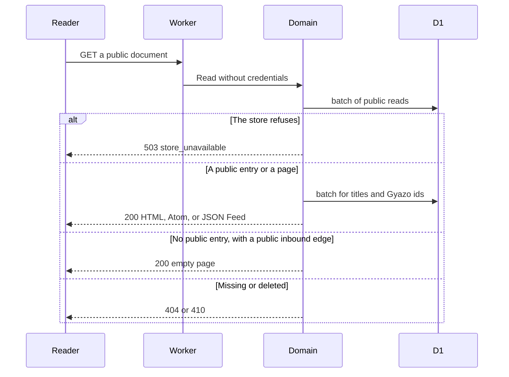
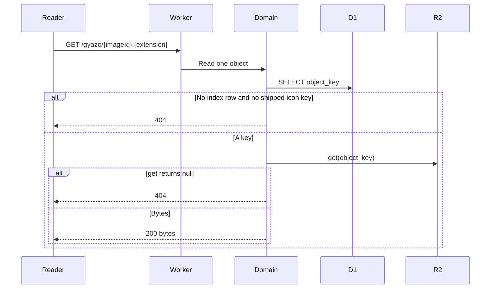
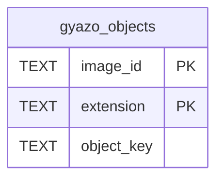

# Public reading design

[日本語](design.ja.md)

## About this document

This design decides how one Worker serves [Public reading](requirements.md) on [weblog.yamanoku.net](../../product.md). An unauthenticated reader receives HTML, the human-readable feeds, empty pages, and Gyazo bytes. The stored body stays plain text.

Write validation, the view path, drafts, and tombstones stay in [Owner writing](../owner-writing/requirements.md). This document does not restate those rules.

### Audience

People and agents implementing or changing this feature.

### Prerequisites

The acceptance criteria in [Public reading](requirements.md). The view path, deliverable entries, edge extraction, and the 410 Tombstone in [Owner writing](../owner-writing/requirements.md).

On the Free plan, D1 allows 50 queries per Worker invocation. A `batch()` call counts as one query against that limit. Statement length and bound parameters still apply to each statement inside the batch. The source is [Limits](https://developers.cloudflare.com/d1/platform/limits/). One statement accepts at most 100 bound parameters. A query result is at most 50 MB. That result cap takes effect on 2026-11-04.

[R2 Workers API](https://developers.cloudflare.com/r2/api/workers/workers-api-reference/) defines `get(key)`. It returns the object body, or null when the key is absent. `list()` exists on the same binding. This feature does not call it while serving a reader.

[JSON Feed 1.1](https://www.jsonfeed.org/version/1.1/) is the feed document for `GET /feed.json`. Publishers serve it as `application/feed+json`.

### Outside this document

- Owner create, update, delete, browser authentication, and the CLI token
- The ActivityPub actor, Follow, signatures, sending activities, and Activity Streams for a live entry
- WebFinger, the outbox, followers, and the inbox
- Bulk import from Cosense
- The order of rendering Cosense notation other than links
- The ORM
- The owner's write API and the owner's list of 50 entries

## Implementation approach

The deliverable is the public routes on the same Worker that handles owner writes. The first response for a public HTML page is server-rendered HTML. After that, a move to another public HTML page on this host runs in the browser and does not replace the whole document. The screen is Svelte. The domain does not import Svelte. Feeds and image bytes stay documents and bytes.

The domain reads public rows, resolves public titles, and renders HTML. Adapters read D1 and the R2 bucket. The domain does not import the Cloudflare SDK, D1 types, R2 types, an ORM, or Fedify types. Replacing the host means replacing those adapters. Rendering is the render port. The object port is the image-fetch port. The store port is the entry store for these reads.

Public routes do not read owner credentials, except GET `/`, GET `/{title}`, and GET `/e/{id}`. GET `/` reads the Access JWT only to include or omit the note field from owner writing. GET `/{title}` reads it only to include or omit the edit link on a public article, bookmark, or page, and to include or omit the `作成` link when no public entry has the title. GET `/e/{id}` reads it to include or omit the reply fields on a public note, to include or omit that edit link on a public article, bookmark, or page, and to return a draft body to the owner. The deliverable list is the same for every caller. An unverified response does not include a draft. GET `/e/{id}`, when the request is verified as the owner, returns that draft's HTML and says the entry is a draft. A view path, the home calendar, and the feeds still omit the draft. GET `/entries/{id}` and GET `/edit/{id}` remain owner-writing paths.

The read flow is as follows.

1. The Worker matches a fixed route before a title path.
2. The domain reads only public rows. A store error becomes 503 `store_unavailable` and stops the response.
3. For an entry or a feed item, the domain renders the stored Markdown and the anchors come from that Markdown. Inbound edges used to decide an empty page are the edges stored when the body was written.
4. Title targets are resolved again from public rows. The stored `target_id` is not the public href, because that id can point at a draft.
5. The Worker returns one HTML document, one feed document, one empty page, or the image bytes.

A page that needs title resolution uses two `batch()` calls. The first reads the entry or the 11-row page. The second resolves titles and Gyazo ids, with `IN` lists chunked at 80 bound parameters. [Limits](https://developers.cloudflare.com/d1/platform/limits/) counts one `batch()` as one query toward the 50-query invocation limit. Statement length and the 100-parameter limit still apply inside the batch. An image request uses one SELECT and one R2 `get`. This feature does not issue one query per edge. This design does not claim that HTML rendering fits the free tier's CPU time per invocation. That time is unmeasured. A request that cannot finish inside the free tier fails for that request. The app does not move onto a paid plan.

`vp dev` answers the public HTML pages from the in-memory domain catalog. Those loaders do not query D1. `/` lists the catalog's deliverable entries. `/{title}` resolves a public catalog title. `/e/{id}` returns the catalog entry for that id. A catalog note is one note and has no reply link. A reply saved during `vp dev` is written to local D1 and does not appear on that page. An article saved from the edit screen during `vp dev` is written to local D1 and does not appear on those pages.

`vp preview` and the deployed Worker read those pages from D1 through the store adapter. They do not add catalog rows. An empty table stays an empty list. A draft row stays absent. Page files do not import `void/db`. The edit screens read D1 in both modes. The acceptance criteria describe the deployed Worker. The catalog is not a second store.

## Architecture and sequence diagrams

The reader talks only to the Worker. The Worker calls the domain. The domain calls a store port and, for a Gyazo image, an object port. The store port's first adapter is D1, binding `DB`. The Gyazo object port's adapter is R2, binding `GYAZO_BUCKET`, bucket `gyazo-archives`. A note image is read from the R2 binding `STORAGE` at the key `notes/{id}`. During `vp dev`, the public HTML loaders stop at the catalog and do not call D1. The diagram is the deployed read.


```mermaid
sequenceDiagram
  participant Reader
  participant Worker
  participant Domain
  participant D1
  Reader->>Worker: GET a public document
  Worker->>Domain: Read without credentials
  Domain->>D1: batch of public reads
  alt The store refuses
    Domain-->>Reader: 503 store_unavailable
  else A public entry or a page
    Domain->>D1: batch for titles and Gyazo ids
    Domain-->>Reader: 200 HTML, Atom, or JSON Feed
  else No public entry, with a public inbound edge
    Domain-->>Reader: 200 empty page
  else Missing or deleted
    Domain-->>Reader: 404 or 410
  end
```


```mermaid
sequenceDiagram
  participant Reader
  participant Worker
  participant Domain
  participant D1
  participant R2
  Reader->>Worker: GET /gyazo/{imageId}.{extension}
  Worker->>Domain: Read one object
  Domain->>D1: SELECT object_key
  alt No index row and no shipped icon key
    Domain-->>Reader: 404
  else A key
    Domain->>R2: get(object_key)
    alt get returns null
      Domain-->>Reader: 404
    else Bytes
      Domain-->>Reader: 200 bytes
    end
  end
```

A further diagram is omitted. Feed pages use the first sequence with a different SELECT. They do not add another runtime component.

## Data model and ER diagrams

This feature reads the entry tables owner writing already stores. It does not change their columns, and it does not insert entries or edges. The columns a public read uses are:

- `entries`: id, kind, title, body, visibility, bookmark_url, published_at, updated_at, view_path
- `edges`: source_id, written_title
- `past_titles`: entry_id, title, recorded_at
- `path_redirects`: path_key, entry_id
- `tombstones`: entry_id, deleted_at

`tombstones` is the signal that a deleted id was delivered. The row has no body. This feature does not read `delivery_records`, `owner_token`, or `cosense_page_id`.

Public hrefs are built from a fresh public lookup. `edges.target_id` stays in the table for the owner's write. It is not selected for public HTML.

Timestamps stay the UTC ISO 8601 strings owner writing stores. This feature compares those strings as text and copies the stored string into the next-page URL. It does not redefine the write format. Text order matches time order when every stored value uses one fixed-width UTC form.

This feature adds `gyazo_objects`. A public request does not write it. The entry write batch does not include it.

- `image_id` is the first path segment of a Gyazo URL.
- `extension` is lowercase and has no dot.
- `object_key` includes the export directory name.
- The primary key is `image_id` plus `extension`. One image id can have several extensions.


```mermaid
erDiagram
  gyazo_objects {
    TEXT image_id PK
    TEXT extension PK
    TEXT object_key
  }
```

There is no foreign key from `gyazo_objects` to `entries`. The image id is parsed from body text. An entry diagram would invent a relationship the tables do not have.

The feed query uses one read index:

- `entries_feed` on `(kind, updated_at, id)` where `visibility = 'public'` and `published_at` is not null

The table also has `entries_titles` on `(updated_at, id)` where `visibility = 'public'` and `title <> ''`. This feature does not read that index.

`view_path` is already unique. `edges.written_title` and `past_titles.title` are already indexed. This feature does not replace those indexes.

## APIs and interfaces

The host in every absolute URL this feature emits is `https://weblog.yamanoku.net`. The request Host header does not change it.

### Route order

The Worker matches these paths before a title. The comparison keys `feed.xml` and `feed.json` take no view path, together with the keys owner writing already reserves, so a title does not occupy a feed URL.

- `GET /`
- `GET /feed.xml`
- `GET /feed.json`
- `GET /feed/articles.xml`
- `GET /feed/notes.xml`
- `GET /feed/bookmarks.xml`
- `GET /gyazo/{imageId}.{extension}`
- `GET /note-images/{id}`
- `GET /e/{id}`
- The owner prefixes `edit`, `entries`, `tokens`, `users`, and `.well-known`

`GET /gyazo` with no image id is not the image route. It does not list the bucket. A title whose key is `gyazo` has no view path, so the request continues as a title path.

`GET /note-images/{id}` returns one stored image. The id is the image id. For a note, that id is the note's immutable id. The entry must be a public note, article, bookmark, or page. A missing image, an entry that is not public, and a draft are 404 and return no bytes. The content type is the stored type: `image/jpeg`, `image/png`, `image/gif`, or `image/webp`. The host does not list the bucket. The bytes are read from the R2 binding `STORAGE` at the key `notes/{id}`. They are not read from `gyazo-archives`. On a public note, the HTML shows that image under the body when the note has one. The image source is `/note-images/{id}`. The alt text is the alternative text stored with the note. On a public article or a public page, the HTML renders the body as Markdown, including a Markdown image, and does not list stored images under the body. On a public bookmark, the HTML renders the body as Markdown, including a Markdown image, and lists every stored image under the body. The alt text of a listed bookmark image is the stored text, and it may be empty. The stored body is not changed. An entry with no image has no such image.

A title URL is one path segment. The segment is percent-decoded to the comparison key. The comparison key is the one owner writing defines: the normalized title with each space replaced by `_`.

### Home and feed queries

`GET /` and the feeds do not share a query. The home page uses `month`. A feed uses `before` and `before_id`.

#### Home month

When `month` is absent or empty, the month is the month that contains today in `Asia/Tokyo`. The value is `YYYY-MM`. The year is four digits and the month is 01 through 12, with the leading zero required. Anything else is 400 `invalid_month`. The body is `text/plain; charset=utf-8` and `Cache-Control` is `no-store`. A 400 is not a calendar. `page` is ignored whatever its value is. An invalid `month` is 400 even when `page` is also present. A request whose `month` is the current Tokyo month is 200 and does not redirect. The dates match `GET /`.

The document title has the shape `2026年11月 - weblog.yamanoku.net`. The year and month are the month of that response. The `h1` stays `weblog.yamanoku.net`. Under it, the month heading has the shape `2026年11月`.

Month movement is a `nav` whose accessible name is `月`. The texts are `前の月` and `次の月`. When the target month is the current Tokyo month, the href is `/`. Otherwise it is `/?month=YYYY-MM`.

The dates are a table. The week starts on Sunday. The headers are `日`, `月`, `火`, `水`, `木`, `金`, and `土`. A cell outside the month is empty and is not a link. The visible text of a day is the day of the month without a leading zero. A day that is not a link is a `time` whose `datetime` is `YYYY-MM-DD`. A linked day is an `a` to that diary's view path. The link's accessible name has the shape `2026年11月26日`. Today's cell has `aria-current="date"`.

The rows read are `visibility = 'public'`, `kind = 'diary'`, `view_path` not NULL, and `title` from the first day of the month through the instant before the first day of the next month. A title that remains is a `YYYY-MM-DD` of length 10 and a real day of that month. This change adds no index and no migration.

The owner's note field stays under the navigation, as before. An unverified response omits it. A `month` query does not change whether the field is present.

#### Same-day entries on a dated diary

The same-day list is added to the HTML of a diary whose title is a real `YYYY-MM-DD`. It sits inside `article.entry-article`, after `.entry-body` and before the owner's edit link. The heading is an `h2` whose text is `当日書いたコンテンツ`. Each link is one `li` in a `ul`. When no entry qualifies, both the `h2` and the `ul` are absent.

The range is from 00:00 in Tokyo on that date, inclusive, until 00:00 in Tokyo on the next date, exclusive. A stored `created_at` has the shape from `Date.toISOString()`. The bounds use that same shape, compared with `created_at >= ? AND created_at < ?`. A row whose shape is not `YYYY-MM-DDTHH:mm:ss.sssZ` stays out of this list. The conditions are `visibility = 'public'`, kind `article`, `note`, or `bookmark`, and `in_reply_to_id` NULL. Order is `created_at` ascending, then `id` ascending. The href is `view_path` when set, and otherwise `/e/{id}`. The text is the non-empty title, or the canonical URL when the title is empty. The body is not rendered.

Public HTML keeps the same read source. `vp dev` reads only the in-memory catalog. `vp preview` and the deployed Worker read only D1.

#### Feeds

The first feed page has no query. A later page sets `before` and `before_id` on that same path.

The response reads 11 rows. It returns the first 10. When an 11th row exists, the next URL is absolute and uses the 10th row's stored sort value as `before` and that row's id as `before_id`. The last page omits the next URL. The predicate for a descending sort is `sort_column < ? OR (sort_column = ? AND id < ?)`. The pages partition that order. A cursor whose row was later deleted still continues from that position.

For a feed, `before` is the stored `updated_at`. Values are percent-encoded. This cursor is not the owner's list cursor. The owner list remains 50 rows and includes drafts.

Both parameters are required together. `before_id` is a lowercase UUID. `before` is a non-empty string of at most 40 characters and contains no whitespace. Any other combination is 400 `invalid_cursor`. The body is `text/plain; charset=utf-8` and `Cache-Control: no-store`. A 400 is not an empty list.

### Shared HTML

One function renders public HTML. An article, a bookmark, and a page render the stored body as Markdown: headings, paragraphs, nested lists, quotations, emphasis, strikethrough, inline code, fenced code, links, images, and a table with a caption. A fenced code block that is a list item, and a list item whose text is `code:` plus an optional info token and whose children are list items, both render as `li` containing `pre` containing `code`. The info string is not an attribute. The code text is escaped. Raw HTML in that text is escaped, and the stored string is never inserted as HTML. A note keeps the stored lines, escaped. Links in a page are the Markdown links the import stored. Rendering does not walk Cosense brackets again, except a bracket that is only a Gyazo URL and one other `http` or `https` URL, and a bracket that is `/project` or `/project/page title`. That project bracket is the scrapbox.io link from the import rule. A `[Title.icon]` bracket is the page icon below. Formulas and lines that start with `$` or `%` stay the strings left in the body.

The href of a link in the body is the URL written in that Markdown. A label may contain brackets. The destination is the URL after the `]` that closes the opening `[`. A nested `[text](URL)` inside the label is that text, not a second anchor. A generated href is only `http`, `https`, or a path on this host. Any other scheme is escaped text. The public page stylesheet selects `a` elements whose href starts with `http://` or `https://`, ignoring case. It sets the underline style to dotted and the thickness to `2/16 rem`. The background is `--color-primitive-yellow-100`. While the anchor is focused, the background stays the component's `--color-primitive-yellow-300`. While it is pressed, the text is orange, so the background is that same yellow mixed lighter with white. That keeps the orange text at the 4.5:1 contrast it has on white. In forced-colors mode the browser replaces this background, and the dotted line remains. Rendering adds no class. The feed fragment stays the same HTML, so a feed reader does not show the dotted line. When the anchor contains an `img` or a `video`, the stylesheet removes the underline, because a dotted underline would cross the picture, and draws a `2/16 rem` dotted outline on that media. A thicker solid line was not used, because the existing link component already thickens the solid underline on hover. A YouTube or Spotify media link is not that anchor. The renderer builds an iframe `src` from the video id, the playlist id, or the Spotify type and id. It does not copy the written URL into the frame. A YouTube `src` is `https://www.youtube-nocookie.com/embed/{id}` or `.../embed/videoseries?list={id}`. A Spotify `src` is `https://open.spotify.com/embed/{type}/{id}`. A Speaker Deck deck is also not that anchor when its player address is known. The public URL `https://speakerdeck.com/{user}/{slug}` does not contain the player id. Before rendering, the page asks `https://speakerdeck.com/oembed.json` for each distinct deck URL in the body and in the bookmark URL, at most 20. The lookup follows redirects. It reads only an iframe src of `https://speakerdeck.com/player/` plus 32 hexadecimal characters. It does not insert the returned HTML. A `slide` query that is a positive integer of at most four digits is added to that src. A URL that is already that player address is embedded without asking. A profile URL, a failed answer, and a missing player stay anchors, and the page stays 200. A successful player address is reused for about 30 days. A note and the home calendar do not ask. The same-day links do not ask either. The iframe title is the link text when that text is not a URL, and otherwise `Speaker Deck`. An X or Twitter post is also not that anchor when the Tokyo calendar date of the entry's `created_at` is `2026-11-27` or later. The renderer writes a `blockquote` with class `twitter-tweet`, `data-dnt="true"`, and `data-lang="ja"`, and an anchor to `https://x.com/{user}/status/{id}`. When the written URL is `/i/web/status/{id}`, the anchor is `https://x.com/i/status/{id}`. It also includes `<script async src="https://platform.x.com/widgets.js" charset="utf-8"></script>`. Those two elements are the only children of a `div` with class `twitter-embed`. A paragraph that is only this embed is that div, not a `p`, because a `p` cannot contain the blockquote and the browser would leave an empty `p` on each side. That script replaces the blockquote with X's embed, which frames `https://platform.twitter.com`. The written URL is not copied into the anchor. When the link text is not a URL, that text is a caption before the blockquote. A profile URL, an intent URL, and any other path stay an anchor or text, as the requirements say. An entry created before that Tokyo date, and an entry with no `created_at`, keep the existing anchor or text. The home card excerpt does not pass `created_at`, so it stays text. A YouTube, Spotify, or Speaker Deck frame for the bookmark URL uses `loading="eager"`. A frame in the body uses `loading="lazy"`. Inbound edges shown on an empty page are the stored edges. Rendering does not extract them from the body again.

The list below resolves the title of a stored edge when an empty page lists its sources. It does not rewrite a Markdown href already stored in an entry body.

Public resolution of a page-edge title:

- Exactly one public entry has that current title. That entry is the target.
- Otherwise, exactly one public past title has the latest `recorded_at` for that string. That entry is the target. The latest `recorded_at` is compared as text. A tie means there is no single target.
- Otherwise there is no single target.

The href is then:

- One public target with a view path: that absolute view path.
- One public target with no view path: the canonical URL.
- No public target: the title path, so an empty page can open.
- No single target: the title path. The renderer does not choose one canonical URL.

The title lookups are `WHERE title IN (...)`, in chunks of 80 bound parameters, inside the second batch. The Worker does not query once per edge.

A `i.gyazo.com` or `gyazo.com` URL is parsed before the anchor is chosen. The host is compared case-insensitively. The image id is the first path segment. An extension is a trailing `.` plus `[A-Za-z0-9]+`, compared case-insensitively and stored lowercase without the dot. Query and fragment are ignored for the match. `scrapbox.io/files` stays the original URL string.

When the written URL's extension is in the index, the HTML uses `https://weblog.yamanoku.net/gyazo/{imageId}.{extension}`. When the written URL has no extension and the index has one key, the HTML uses that key's extension. When the written URL has no extension and the index has more than one key, the HTML keeps the original URL. When the index has no key, the HTML keeps the original URL. A kept URL is an external link. The renderer does not pick an object and does not emit the host URL.

Media for a rewritten URL:

- `png`, `jpg`, `jpeg`, `gif`, `webp`: an `img`. The alt text is the original URL.
- `mp4`: a `video` with `controls`.
- Any other extension: an anchor to the host URL.

A bracket whose text is only a Gyazo URL and one other `http` or `https` URL uses that same choice. An `img` or a `video` is wrapped in a link to the other URL. The alt text is the original Gyazo URL. When the choice is not an image or a video, the bracket becomes two links in the written order. The Gyazo link is the host URL when one non-image extension is selected, and the original URL otherwise. The stored body remains the bracket.

The ids are loaded with `WHERE image_id IN (...)`, chunked at 80, in the same batch as title resolution.

A bracket whose whole text is a title plus the suffix `.icon`, and which is not followed by `(`, is a page icon. The title is that text without the suffix. Inline code and fenced code keep the bracket. A note keeps the stored lines, so a note does not show the icon. The home calendar and the same-day links do not resolve icons. The lookup is `WHERE title IN (...)` and `visibility = 'public'`, in chunks of 80. When more than one public row has that title, the bracket stays text. When the count is zero, the title is taken from the icon list shipped with the Worker. That entry names the image id, one still-image extension, and the object key in `gyazo-archives`. When one public row exists, that list is not used for the title. The query does not read a draft. A public request does not write D1 for this icon. The icon is the first image in the target entry's stored body. A Markdown image whose URL is not a Gyazo URL means the page has no Gyazo icon, and the bracket stays text. Otherwise the first Gyazo URL outside inline code and fenced code is the icon. The stored body has no pinned-image flag, so the first image is the icon. The still-image extensions are `png`, `jpg`, `jpeg`, `gif`, and `webp`. When the URL names one of those extensions and the index has it, the HTML uses it. When the URL has no extension and the index has one still-image extension, the HTML uses that extension. An `mp4` row is outside that choice. When no still-image extension can be chosen, the bracket stays text. The `img` source is `https://weblog.yamanoku.net/gyazo/{imageId}.{extension}`. The alt text is the title. The `img` has `class="page-icon"`, `width="20"`, `height="20"`, and `loading="lazy"`. When the icon comes from a public entry, the anchor href is `/` plus the percent-encoded view path when the entry has one, and otherwise `/e/{id}`. When the icon comes from the shipped list, the anchor href is `/` plus the percent-encoded title, with each space written as `_`. That anchor is not an edge. The stored body stays the bracket. The stylesheet sizes `img.page-icon` to `1.25em` by `1.25em` and removes the underline from an anchor that contains it. The external-link mark stays on `http` and `https` anchors. This href is a path on this host.

On the view path and on the canonical HTML page, a bookmark's external URL that is not a media embed is rendered beside the `h1`, inside `.entry-heading`. A YouTube or Spotify media URL, a Speaker Deck URL whose player is known, or an X post URL when the bookmark's Tokyo creation date is `2026-11-27` or later, is the same embed as a body link. That iframe is a child of `article.entry-article`, after `.entry-heading`, and it is not inside `.entry-heading`. Any other `http` or `https` value is an external anchor whose text is the URL, inside `.entry-heading`. Any other non-empty value is escaped text, because owner writing does not validate the scheme. The stored body is not rewritten. An article, a note, and a page do not render that anchor. A same-day bookmark links to this host's view path or canonical URL.

Document responses use `text/html; charset=utf-8` and `Cache-Control: no-cache`. The Content-Security-Policy value is:

```text
default-src 'none'; img-src 'self'; media-src 'self'; script-src https://platform.x.com; frame-src https://www.youtube-nocookie.com https://open.spotify.com https://speakerdeck.com https://platform.twitter.com https://platform.x.com; base-uri 'none'; form-action 'none'
```

When GET `/e/{id}` includes a reply field, that response sets `form-action` to this host's `/edit`. Other document responses keep `form-action 'none'`.

The document language is `ja`. The visible next-page anchor text is `次へ`. These responses do not vary on a cookie, except the owner response for GET `/`, for a note's GET `/e/{id}`, for a public article, bookmark, or page on GET `/{title}` and GET `/e/{id}` when that response includes the edit link, and for GET `/{title}` when no public entry has the title and the response includes the `作成` link.

Entry HTML has a canonical link, plus alternate links to `/feed.xml` and `/feed.json`. The `h1` is the current title. On a bookmark, an external URL that is not a media embed sits beside that heading. A YouTube, Spotify, known Speaker Deck, or eligible X post URL is the embed inside the article, after the heading. An empty title omits the `h1`, and the document title is the canonical URL. A title page with no entry uses `weblog.yamanoku.net` as the document title. A note thread uses the requested note's title, and uses that note's canonical URL when the title is empty. Feed pages use the same head links.

A public note's GET `/e/{id}` lists the thread. The thread root is that note's `thread_root_id` when the column is set, and otherwise that note's id. The rows are the public note whose id is the root, plus public notes whose `thread_root_id` is the root. Order is `created_at` ascending, then `id` ascending. Each body is shown in that order. A reply whose `in_reply_to_id` is still in the thread has a same-page link to that note. A reply whose target is absent has no target link. An article, a bookmark, and a page load one entry and do not run the thread query.

### Related pages

The view path, the canonical URL, and the owner's canonical URL of a draft render the related-pages list from [Public reading](requirements.md) after the body. A dated diary renders it after the same-day list. The heading is an `h2` whose text is `関連ページ`. The entries are a `ul`. Each item is one `a` with class `dads-link`. The list is absent when it would be empty. `GET /` and the feeds do not render it.

The host derives the titles from the stored Markdown with the page-link rules in that requirement. It does not write `edges` on this read, and it does not rewrite the stored body. Outbound titles use `WHERE title IN (...)`, chunked at 80 bound parameters. When no public row has that current title, the host reads `past_titles` for that string and keeps the public entry with the latest `recorded_at`. A tie drops the title. Inbound candidates are public rows other than the subject whose body contains `](/{path})`, `](/{path}#`, or `[{title}](/`. `{path}` is the title with spaces written as `_`, and also that path percent-encoded. The statement uses `instr`, in chunks of 20 needles. A candidate stays only when extraction resolves to the subject, so a fenced or external match drops out. This read does not add a query per edge. The inbound statement has no `LIMIT`.

### Feeds

A feed row is `visibility = 'public'`, `published_at` is not null, `in_reply_to_id` is null, and `kind` is `article`, `note`, or `bookmark`. Order is `updated_at` descending, then `id` descending. Text comparison of the lowercase UUID is the tie-break. A public page is excluded. A kind feed adds `kind = ?`. There is no per-kind JSON Feed.

`GET /` is the month table above. It does not show entry cards. Feeds are not divided by date.

The diary entry page adds `entry--diary` on the element that already has `entry-article`. The article entry page adds `entry--article` the same way. The create forms and the edit form for those kinds add the same class beside `form-stack`. Note, bookmark, and page roots do not get those two classes. The shared layout stays on `entry-card`, `entry-article`, and `form-stack`. These kind classes do not change the rendered text. A diary `.entry-body` sets `rule` to `1px solid var(--color-neutral-solid-gray-200)` and `gap` to `5.5rem` when the browser supports the `rule` property. When it does not, that diary body sets `gap` to `1.5rem`. An article, a note, a bookmark, and a page do not receive those declarations.

`GET /feed.xml` and the three kind feeds are Atom. The media type is `application/atom+xml; charset=utf-8`. The feed `id` is the absolute URL of that feed without a query. The feed title is `weblog.yamanoku.net` for `/feed.xml`, and `記事`, `ノート`, or `ブックマーク` for the kind feeds. `link rel="self"` is the absolute URL of this page, including the query when one is present. `link rel="alternate"` points at `GET /`. `link rel="next"` is present only when a next page exists. Each entry `id` is the canonical URL. For a bookmark whose external URL starts with `http://` or `https://`, the entry `link rel="alternate"` is that URL. For every other entry, it is the view path or the canonical URL. `published` is the stored `published_at`. `updated` is the stored `updated_at`. The feed order is `updated_at` descending, then `id` descending. The entry `title` is the stored title. When the title is empty, the Atom title is the canonical URL. `content type="html"` is the same body fragment as the entry page. For a bookmark, that content also includes the external URL. The entry page shows a non-media URL beside the title, and shows a YouTube, Spotify, or known Speaker Deck URL as the embed inside the article. An empty feed is 200 and has no entry elements. Its feed `updated` is `1970-01-01T00:00:00Z`.

`GET /feed.json` is JSON Feed 1.1. `version` is `https://jsonfeed.org/version/1.1`. `title` is `weblog.yamanoku.net`. `home_page_url` is `https://weblog.yamanoku.net/`. `feed_url` is the absolute URL of this page. `items` is required and may be empty. `items[].id` is the canonical URL. For a bookmark whose external URL starts with `http://` or `https://`, `items[].url` is that URL. For every other item, `items[].url` is the view path or the canonical URL. `items[].content_html` is the same fragment as Atom content. `items[].date_published` is the stored `published_at`. `items[].date_modified` is the stored `updated_at`. `items[].title` is omitted when the stored title is empty. A bookmark whose external URL is `http` or `https` sets `items[].external_url` to that URL. `next_url` is present only when a next page exists, and it differs from `feed_url`. An empty feed is 200 with `"items": []`.

### Path `/pages`

There is no title index and no `src/pages/pages.svelte`. The comparison key `pages` is not reserved. `GET /pages` follows the title path below. The response does not list articles.

### Title path

After the fixed routes, the Worker decides `GET /{comparison key}` in this order.

1. A public `view_path` match is 200 HTML for that entry.
2. A `path_redirects` row whose entry is public is 301. The absolute `Location` is the current view path when one exists, and otherwise the canonical URL. `Cache-Control` is `no-cache`. A destination that is draft or missing is ignored. The response does not redirect.
3. When no public `view_path` matched, and at least one public entry has this comparison key, the response is 404. Those entries remain at their canonical URLs. This is the collision and reserved-key case. The response does not choose one entry.
4. When no public entry has the key, and at least one public edge has a `written_title` whose comparison key equals it, the response is 200. The page shows the decoded comparison key as the `h1`. It lists each public source once, ordered by `updated_at` descending and then `id` descending. The anchor text is the source's current title. The href is that source's view path, or its canonical URL when it has no view path. The page has no next-page URL. The query has no `LIMIT`. A result over the 50 MB cap fails, and the response is 503.
5. Otherwise the response is 404.

A draft with the same title does not change this order. Reading does not insert an entry. The empty-page query matches `replace(written_title, ' ', '_')` to the comparison key, which is valid because stored edge titles are already normalized.

The 404 and 410 HTML documents contain the sentence `見つかりません` or `削除しました` and no entry body. They do not contain the word draft. `Cache-Control` is `no-cache`.

### Canonical URL

`GET /e/{id}` reads the public row and returns the same entry HTML as the view path.

When no public row exists and `tombstones` has the id, the response is 410. When `Accept` contains `application/activity+json` or `application/ld+json`, and it contains neither `text/html` nor `*/*`, the body is an Activity Streams Tombstone. Its `id` is the canonical URL, its `type` is `Tombstone`, and `deleted` is the stored `deleted_at`. The content type is `application/activity+json; charset=utf-8`. The deleted body is absent. Any other Accept is 410 HTML and also omits the deleted body.

When no public row exists and no tombstone exists, the response is 404. A draft id takes this branch.

When the row is public and `Accept` contains `application/activity+json` or `application/ld+json`, and it contains neither `text/html` nor `*/*`, the response is the Activity Streams object for that entry. The content type is `application/activity+json; charset=utf-8`. `Cache-Control` is `no-cache`. The object rules belong to ActivityPub. A browser Accept that includes `text/html` receives HTML. An Accept that includes `*/*` also receives HTML.

### Image bytes

`GET /gyazo/{imageId}.{extension}` selects `object_key` where `image_id` and the lowercased extension match. When no index row matches, and the shipped page-icon list names that image id and extension, the route uses that list's object key. The adapter then calls `get(object_key)` on `GYAZO_BUCKET`. It does not call `list()`.

No matching key, or a null `get`, is 404 with an empty body and `Cache-Control: no-store`. The content type is `text/plain; charset=utf-8`.

A body uses the object's `httpMetadata.contentType` when that value is present. Otherwise the extension map is `png` to `image/png`, `jpg` and `jpeg` to `image/jpeg`, `gif` to `image/gif`, `webp` to `image/webp`, `mp4` to `video/mp4`, and every other extension to `application/octet-stream`. The Worker does not sniff the bytes. A 200 uses `Cache-Control: public, max-age=86400`. This feature does not replace archive bytes. The one-day cache keeps a repeat view from counting again toward the daily Worker request allowance. An image 404 is not cached, so a later index load becomes visible.

Each image response counts as one Worker request.

### Store failure

D1 errors, including a free-allowance refusal and a result that exceeds the cap, become 503 `store_unavailable`. An R2 `get` that throws does too. The body is `text/plain; charset=utf-8` and `Cache-Control: no-store`. The response is not 404, 410, or 301. It does not ask the reader to buy a plan. Stored rows remain. Work waits until 00:00 UTC or fails for that request.

## External service integration

D1 is the store adapter, binding `DB`. The adapter queries through `db` from `void/db`. [D1](https://void.cloud/guide/database/d1) says those queries use a D1 session for each Void request, and that replicas can lag between requests. The domain does not know `D1Database` and does not import `void/db`. The source for the query budget and the 50 MB cap is [Limits](https://developers.cloudflare.com/d1/platform/limits/). The source for daily free-tier refusal, leaving stored rows in place, is the [D1 changelog of 2026-09-01](https://developers.cloudflare.com/changelog/post/2026-09-01-d1-free-tier-limit-enforcement/).

R2 is the object adapter for the existing archive, binding `GYAZO_BUCKET`, bucket `gyazo-archives`. The domain receives bytes and a content type from the port. It does not know `R2Bucket`. `get` is defined in the [Workers API reference](https://developers.cloudflare.com/r2/api/workers/workers-api-reference/). This feature does not upload and does not list the bucket. Storage beyond 10 GB a month for the existing archive stays outside the zero-yen target. A note image is a second read, from the R2 binding `STORAGE` at the key `notes/{id}`. This feature does not upload that object and does not list that bucket. The content type of `GET /note-images/{id}` is the type stored with the note.

The public routes are not behind Cloudflare Access. Access remains on `/login`. An unverified `/edit` or `/new` is 404 from the Worker.

## Data handling

The public response is derived from stored plain text, public edges, past titles, redirects, tombstones, and `gyazo_objects`. Rendering is not written back to the entry. A read does not create an entry or an edge.

The Gyazo index is loaded by an owner command, not by a reader. The command reads a local listing of `{directory}/{imageId}.{extension}` and inserts or replaces `gyazo_objects` rows. It does not call R2 `list` or R2 `put`. A second run can continue a partial load because a missing id keeps the original URL in HTML. The command does not delete index rows that are absent from the listing. Removing a public image URL requires deleting that index row. This feature does not delete archive bytes.

The listing counted on 2026-11-01 had 15686 image files. That row count fits the free daily row-write allowance. The command uses `batch()` calls small enough to finish, and it can be run again.

Public bodies, titles, and bookmark URLs may name a person. They are world-readable because the owner set visibility to public. An unverified response does not read a draft. The verified owner's GET `/e/{id}` does. This feature collects no account data. Image bytes at the public image URL are world-readable. There is no extra consent step.

## Authentication and authorization notes

None of these routes check a credential to choose a draft or a different entry list. GET `/` reads `Cf-Access-Jwt-Assertion`, or the `CF_Authorization` cookie when that header is absent, only to include or omit the note field. GET `/{title}` reads the same values only to include or omit the edit link on a public article, bookmark, or page, and to include or omit the `作成` link when no public entry has the title. GET `/e/{id}` reads the same values only to include or omit the reply fields on a public note, and to include or omit that edit link on a public article, bookmark, or page. A missing or invalid JWT stays 200 and omits the field and the link. The owner response that includes the field, a reply field, or the edit link uses `Cache-Control: private, no-store`. Other routes do not read `Cf-Access-Jwt-Assertion` or `Authorization`. Drafts stay on the owner routes from owner writing.

## Security considerations

Public HTML escapes stored text before it inserts a generated anchor whose URL is `http`, `https`, or a path on this host. The content security policy refuses scripts and refuses images from other hosts. A rewritten image is loaded from this host. An original Gyazo URL that this feature keeps is an anchor, so the policy does not fetch it as an image.

Responses on these routes do not include a draft body. GET `/` for a verified owner also sends `Cache-Control: private, no-store` and `Vary: Cookie`, so a shared cache does not store the note field. A verified owner's GET `/e/{id}` for a public note sends the same two headers, so a shared cache does not store the reply fields. A verified owner's GET `/{title}` or GET `/e/{id}` for a public article, bookmark, or page sends the same two headers when the edit link is included, so a shared cache does not store that link. A verified owner's GET `/{title}` with no public entry sends the same two headers when the `作成` link is included, so a shared cache does not store that link. Other responses do not vary on a cookie. A deleted body is not selected. The image route returns one object's bytes. A path that is not the image route does not return archive bytes and does not list the bucket.

## Deployment notes

The migration for this feature creates `gyazo_objects` and the two read indexes. An empty index is valid. Until rows exist, entry HTML keeps original Gyazo URLs, and image GET returns 404.

The index load is an owner command run from the local export listing. It is not a public route and it is not part of an entry write. The first database can start with an empty `gyazo_objects` table.

## Alternatives considered

### Keep the home page as paged cards

Cards of twelve open the next page in updated-time order. The reader opens a dated diary, so the home page is a month table. An old `/?page=2` returns the current month's calendar instead of 400 or 404. Feeds keep the keyset.

### An opaque cursor

An opaque token can hide the sort keys. It needs a second encoding and still has to carry `published_at` or `updated_at` plus the id. The explicit query uses the stored strings directly.

### Listing the R2 bucket while rendering

A list would find keys without an index. The public request would page through the bucket, and more than one key would still have to be chosen. The D1 index answers the id in one SELECT, and the public request calls `get` for one key.

### Putting the Gyazo index in the entry write batch

The index would then commit with an unrelated entry. A reader request would still need the rows before any entry HTML can rewrite URLs. The load stays a separate owner command.

### HTML for an Activity Streams-only request

Returning the entry HTML would present a document that is not the Activity Streams object. The activity-only Accept receives that object. A request that also accepts `text/html` still receives HTML. A deleted id uses the same split. An activity-only Accept receives a Tombstone. An Accept that contains `text/html` or `*/*` receives 410 HTML.

### Returning a draft on the public path when a cookie is present

The owner could open a draft at its view path. A cache that varies on the cookie can also store that response under the public URL. Public routes ignore credentials, and the owner reads drafts at `/entries/{id}` and `/edit/{id}`.

## Open questions

None that block implementation.

Markdown for an article, a bookmark, and a page is rendered by one function, as the body HTML requirement says. A `[Title.icon]` bracket follows the page-icon rule above. Formulas and lines that start with `$` or `%` that remain in the body stay with the requirements of that rendering. Until those requirements exist, this feature shows that source text. The CPU time of this HTML render is unmeasured. That measurement does not change the routes above.
